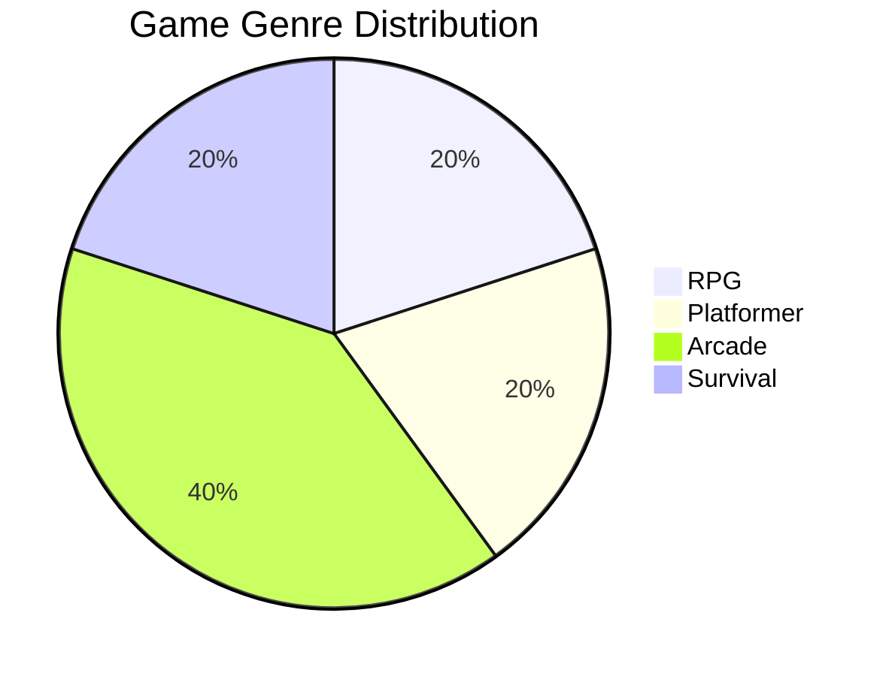
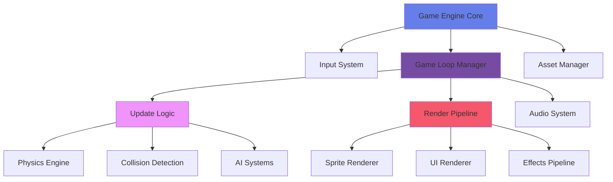
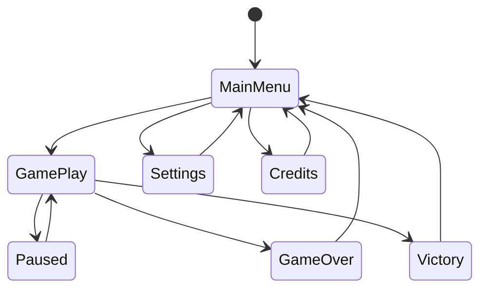
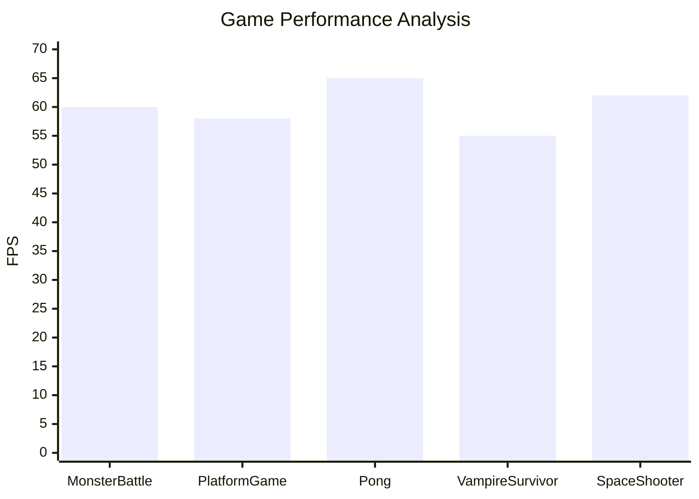

# 🎮 5games - Master Python Game Development

[](https://www.python.org/downloads/)
[](https://www.pygame.org/)
[](LICENSE)
[](https://github.com/Sayan-itachi/5games/actions)
[](https://codecov.io/gh/Sayan-itachi/5games)


## 📑 Table of Contents

- [🎯 Overview](#-overview)
- [⚡ Installation](#-installation)
- [🚀 Usage](#-usage)
- [✨ Features](#-features)
- [🏗️ Architecture & Diagrams](#️-architecture--diagrams)
- [💻 Code Examples](#-code-examples)
- [📸 Screenshots & GIFs](#-screenshots--gifs)
- [🎨 Customization & Theming](#-customization--theming)
- [🗺️ Roadmap](#️-roadmap)
- [🤝 Contributing](#-contributing)
- [📄 License & Acknowledgments](#-license--acknowledgments)

## 🎯 Overview

[](https://github.com/Sayan-itachi/5games)

This repository contains **five immersive and educational games** built with Python and Pygame, designed to take you from beginner to game development master. Each project demonstrates core programming concepts while delivering engaging gameplay experiences. Perfect for developers looking to level up their Python skills through hands-on game creation.

**YouTube Tutorial**: [Master Python by making 5 games](https://www.youtube.com/watch?v=8OMghdHP-zs)



## ⚡ Installation

### Prerequisites
- Python 3.8 or higher
- pip package manager

### Quick Setup

1. **Clone the repository**
   ```bash
   git clone https://github.com/Sayan-itachi/5games.git
   cd 5games
   ```

2. **Create a virtual environment**
   ```bash
   # Windows
   python -m venv game_env
   game_env\Scripts\activate
   
   # macOS/Linux
   python3 -m venv game_env
   source game_env/bin/activate
   ```

3. **Install dependencies**
   ```bash
   pip install -r requirements.txt
   ```

4. **Verify installation**
   ```bash
   python -c "import pygame; print('Pygame installed successfully!')"
   ```

## 🚀 Usage

### Quick Start
Navigate to any game directory and launch:

```bash
# Monster Battle RPG
cd "Monster battle"
python main.py

# Platform Adventure
cd "Platform"
python main.py

# Classic Pong
cd "Pong"
python main.py

# Vampire Survivor
cd "Vampire survivor"
python main.py

# Space Shooter
cd "space shooter"
python main.py
```

### Game Controls

| Game | Controls | Objective |
|------|----------|-----------|
| **Monster Battle** | `SPACE` to attack, `ARROW KEYS` to navigate | Defeat all monsters in turn-based combat |
| **Platform Game** | `ARROW KEYS` to move, `SPACE` to jump | Reach the end while avoiding obstacles |
| **Pong** | `W/S` (P1), `↑/↓` (P2) | Score 5 points to win |
| **Vampire Survivor** | `WASD` to move, `AUTO-FIRE` | Survive endless vampire waves |
| **Space Shooter** | `ARROW KEYS` to move, `SPACE` to shoot | Destroy all enemy ships |


## ✨ Features

- **🎓 Educational Focus**: Learn OOP, game loops, collision detection, and more
- **🏗️ Modular Architecture**: Clean separation of game logic, rendering, and assets
- **🎨 Rich Graphics**: Sprite animations, particle effects, and dynamic backgrounds
- **🎵 Immersive Audio**: Sound effects and background music integration
- **🎯 Progressive Difficulty**: From simple mechanics to complex game systems
- **🔧 Highly Customizable**: Easy to modify, extend, and personalize
- **🌐 Cross-Platform**: Runs seamlessly on Windows, macOS, and Linux
- **📱 Responsive Design**: Adaptive UI for different screen resolutions

## 🏗️ Architecture & Diagrams

### Core Game Engine Architecture



### Game State Management



### Performance Metrics



## 💻 Code Examples

### Game Object Base Class
```python
import pygame
from abc import ABC, abstractmethod

class GameObject(ABC):
    """Base class for all game objects with common functionality"""
    
    def __init__(self, x, y, width, height):
        self.rect = pygame.Rect(x, y, width, height)
        self.velocity = pygame.Vector2(0, 0)
        self.active = True
        
    @abstractmethod
    def update(self, dt):
        """Update object state - must be implemented by subclasses"""
        pass
        
    @abstractmethod
    def render(self, screen):
        """Render object to screen - must be implemented by subclasses"""
        pass
        
    def check_collision(self, other):
        """Check collision with another game object"""
        return self.rect.colliderect(other.rect) if self.active and other.active else False
```

### Player Controller System
```python
class Player(GameObject):
    """Enhanced player class with smooth movement and animations"""
    
    def __init__(self, x, y):
        super().__init__(x, y, 32, 48)
        self.speed = 200  # pixels per second
        self.health = 100
        self.animation_frame = 0
        self.facing_right = True
        
    def handle_input(self, keys, dt):
        """Process player input with delta time for smooth movement"""
        movement = pygame.Vector2(0, 0)
        
        if keys[pygame.K_a] or keys[pygame.K_LEFT]:
            movement.x = -1
            self.facing_right = False
        if keys[pygame.K_d] or keys[pygame.K_RIGHT]:
            movement.x = 1
            self.facing_right = True
        if keys[pygame.K_w] or keys[pygame.K_UP]:
            movement.y = -1
        if keys[pygame.K_s] or keys[pygame.K_DOWN]:
            movement.y = 1
            
        # Normalize diagonal movement
        if movement.length() > 0:
            movement = movement.normalize()
            
        self.velocity = movement * self.speed * dt
        self.rect.x += self.velocity.x
        self.rect.y += self.velocity.y
```

### Game State Manager
```python
class GameStateManager:
    """Manages different game states and transitions"""
    
    def __init__(self):
        self.states = {}
        self.current_state = None
        
    def add_state(self, name, state):
        """Add a new game state"""
        self.states[name] = state
        
    def change_state(self, name):
        """Transition to a different state"""
        if self.current_state:
            self.current_state.exit()
        self.current_state = self.states.get(name)
        if self.current_state:
            self.current_state.enter()
            
    def update(self, dt):
        """Update current state"""
        if self.current_state:
            self.current_state.update(dt)
            
    def render(self, screen):
        """Render current state"""
        if self.current_state:
            self.current_state.render(screen)
```

## 📸 Screenshots & GIFs

### Monster Battle RPG


Turn-based combat system with strategic gameplay and character progression.

### Platform Adventure


Dynamic platforming with physics-based movement and challenging obstacles.

### Classic Pong


The timeless arcade classic with modern visual enhancements.

### Vampire Survivor


Intense survival gameplay with waves of enemies and power-ups.

### Space Shooter


Fast-paced space combat with multiple enemy types and boss battles.

## 🎨 Customization & Theming

### Color Schemes
The games support multiple visual themes:

```python
# Dark Gaming Theme
DARK_THEME = {
    'background': '#1a1a2e',
    'primary': '#16213e',
    'accent': '#0f4c75',
    'text': '#ffffff',
    'highlight': '#3282b8'
}

# Neon Cyberpunk Theme  
NEON_THEME = {
    'background': '#0d0221',
    'primary': '#460c68',
    'accent': '#e736b7',
    'text': '#ffffff',
    'highlight': '#00d9ff'
}
```

### Custom Assets
- **Sprites**: Replace files in `/assets/sprites/` with your own artwork
- **Audio**: Add custom sounds to `/assets/audio/`
- **Fonts**: Include TTF files in `/assets/fonts/`

### UI Customization
```css
/* Game UI styling hints for web integration */
.game-button {
    background: linear-gradient(45deg, #667eea, #764ba2);
    border: none;
    border-radius: 8px;
    color: white;
    padding: 12px 24px;
    font-family: 'Orbitron', monospace;
    cursor: pointer;
    transition: all 0.3s ease;
}

.game-button:hover {
    transform: translateY(-2px);
    box-shadow: 0 8px 16px rgba(102, 126, 234, 0.4);
}
```

## 🗺️ Roadmap

| Phase | Feature | Status | Timeline |
|-------|---------|--------|----------|
| **Phase 1** | Core engine development | ✅ Complete | Q1 2024 |
| **Phase 2** | Monster Battle & Pong | ✅ Complete | Q1 2024 |
| **Phase 3** | Platform Game implementation | 🔄 In Progress | Q2 2024 |
| **Phase 4** | Vampire Survivor mechanics | ⏳ Planned | Q2 2024 |
| **Phase 5** | Space Shooter & polish | ⏳ Planned | Q3 2024 |
| **Phase 6** | Multiplayer networking | 🔮 Future | Q4 2024 |
| **Phase 7** | Mobile port (Pygame CE) | 🔮 Future | 2025 |
| **Phase 8** | Level editor tools | 🔮 Future | 2025 |

### Upcoming Features
- 🎯 Achievement system
- 🏆 Global leaderboards  
- 🎮 Controller support
- 🌐 Web deployment
- 📱 Touch controls
- 🔊 Advanced audio mixing

## 🤝 Contributing

We welcome contributions from developers of all skill levels! Here's how to get involved:

### Quick Contribution Guide

1. **🍴 Fork the repository**
   ```bash
   # Click the "Fork" button on GitHub, then:
   git clone https://github.com/YOUR_USERNAME/5games.git
   cd 5games
   ```

2. **🌿 Create a feature branch**
   ```bash
   git checkout -b feature/amazing-new-feature
   ```

3. **💻 Make your changes**
   - Add new features, fix bugs, or improve documentation
   - Follow the existing code style and conventions
   - Add comments for complex logic

4. **✅ Test your changes**
   ```bash
   # Test all games still work
   python -m pytest tests/
   ```

5. **📝 Commit with clear messages**
   ```bash
   git add .
   git commit -m "feat: add amazing new feature that does X"
   ```

6. **🚀 Push and create Pull Request**
   ```bash
   git push origin feature/amazing-new-feature
   ```

### Contribution Ideas
- 🐛 Bug fixes and optimizations
- 🎨 New sprites and animations  
- 🎵 Sound effects and music
- 🏗️ New game mechanics
- 📚 Documentation improvements
- 🌐 Internationalization

### Code Style Guidelines
- Use descriptive variable names
- Keep functions under 50 lines when possible
- Add docstrings to all classes and methods
- Follow PEP 8 Python style guide

## 📄 License & Acknowledgments

### License
This project is released under the **CC0 1.0 Universal License** - feel free to use, modify, and distribute without restrictions. See [LICENSE](LICENSE) for full details.

### 🙏 Acknowledgments

- **Pygame Community** - For the amazing game development framework
- **Sayan-itachi** - Original creator and YouTube educator
- **Contributors** - Everyone who has helped improve these games
- **Open Source Assets** - Various artists who provided free game assets

### 📚 Educational Resources
- [Pygame Documentation](https://www.pygame.org/docs/)
- [Python Game Development Course](https://www.youtube.com/watch?v=8OMghdHP-zs)
- [Game Programming Patterns](https://gameprogrammingpatterns.com/)

### 🎮 Inspired By
- Classic arcade games of the 80s and 90s
- Modern indie game development practices
- Educational programming methodologies

---

<div align="center">

**⭐ Star this repo if it helped you learn game development! ⭐**

[🎮 Play Now](https://github.com/Sayan-itachi/5games) • [📺 Watch Tutorial](https://www.youtube.com/watch?v=8OMghdHP-zs) • [🐛 Report Bug](https://github.com/Sayan-itachi/5games/issues) • [💡 Request Feature](https://github.com/Sayan-itachi/5games/issues)

</div>
